**Author**: Chen Sijia

**Dataset**: IBM Telco Customer Churn  

**Tutorial Link**: https://github.com/databricks-industry-solutions/survival-analysis  

**Environment**: PySpark Environment

---
## Table of Contents
1. [Introduction](#introduction)
2. [Data Overview](#data-overview)
3. [Survival Analysis Methods](#survival-analysis-methods)
4. [Kaplan-Meier Survival Analysis](#kaplan-meier-survival-analysis)
5. [Cox Proportional Hazards Model](#cox-proportional-hazards-model)
6. [Accelerated Failure Time Model (AFT)](#accelerated-failure-time-model-aft)
7. [Customer Lifetime Value (CLV)](#customer-lifetime-value-clv)
8. [Conclusion](#conclusion)
9. [Business Recommendations](#business-recommendations)
10. [Model Limitations](#model-limitations)

---

## 1. Introduction

### 1.1 What is Survival Analysis?

Survival Analysis is a collection of statistical methods for studying "time-to-event" data. Although originally applied in medicine (studying patient survival time), it is now widely used in:
- **Telecommunications**: Customer churn prediction
- **Manufacturing**: Equipment failure prediction
- **Finance**: Loan default time prediction
- **E-commerce**: User activation time prediction

### 1.2 Project Overview

This case uses survival analysis to predict churn time for telecom customers, helping enterprises:
- Identify customers with high churn risk
- Take retention actions at critical time points
- Optimize customer retention strategies

---

## 2. Data Overview

### 2.1 Data Source
- **Dataset**: IBM Telco Customer Churn Dataset
- **Original records**: 7,043
- **Analysis sample size**: 3,351 (month-to-month contract + internet service customers)

### 2.2 Sample Characteristics

| Metric | Value |
|--------|-------|
| Number of churned customers | 1,556 |
| Churn rate | 46.4% |
| Observation time range | 0-72 months |

---

## 3. Survival Analysis Methods

### 3.1 Kaplan-Meier Estimator

**Basic Principle**:  
Non-parametric method to estimate the survival function S(t) = P(T > t)

**Formula**:  
S(t) = ∏(1 - d_j / n_j)

Where:
- d_j: number of events (churns) at time point j
- n_j: number at risk just before time point j

**Advantages**:
- No distributional assumptions
- Handles censored data
- Intuitive and easy to interpret

**Application**: Visualize survival curves for different groups, compare differences between groups

### 3.2 Cox Proportional Hazards Model

**Basic Principle**:  
Semi-parametric model to analyze the effect of multiple covariates on survival time

**Model Form**:  
h(t|X) = h₀(t) × exp(β₁X₁ + ... + βₚXₚ)

Where:
- h(t|X): hazard function
- h₀(t): baseline hazard
- β: covariate coefficients
- exp(β): hazard ratio (HR)

**Advantages**:
- Analyzes multiple factors simultaneously
- No need to specify baseline hazard
- HR < 1 indicates protective factor, HR > 1 indicates risk factor

**Application**: Identify key factors influencing customer churn

### 3.3 Accelerated Failure Time (AFT) Model

**Basic Principle**:  
Parametric model assuming covariates accelerate or decelerate survival time

**Model Form**:  
T = exp(β₁X₁ + ... + βₚXₚ + σ·ε)

Where:
- T: survival time
- exp(β): time acceleration factor (>1 extends, <1 shortens)
- ε: error term

**Advantages**:
- Directly predicts survival time
- Handles multiple distributions (Weibull, LogNormal, LogLogistic)

**Application**: Predict customer churn probability at specific time points

### 3.4 Log-Rank Test

**Basic Principle**:  
Chi-square test to test whether multiple survival curves are statistically equivalent

**Null Hypothesis**: No significant difference among survival curves of groups

**Application**: Verify whether survival curves differ significantly across groups

### 3.5 Method Comparison

| Method | Type | Purpose | Output |
|--------|------|---------|--------|
| KM | Non-parametric | Estimate survival function | Survival probability |
| Cox | Semi-parametric | Analyze influencing factors | Hazard ratio (HR) |
| AFT | Parametric | Predict survival time | Time acceleration factor |
| Log-rank | Non-parametric test | Compare differences between groups | test_statistic, p, -log2(p) |

---

## 4. Kaplan-Meier Survival Analysis

### 4.1 Analysis Workflow

```python
from lifelines import KaplanMeierFitter
from lifelines.statistics import pairwise_logrank_test

# Overall KM fit
kmf = KaplanMeierFitter()
kmf.fit(telco_pd['tenure'], telco_pd['churn'].astype(float))

# Group KM and log-rank test
def plot_km(col):
    for r in telco_pd[col].unique():
        ix = telco_pd[col] == r
        kmf.fit(telco_pd.loc[ix, 'tenure'], telco_pd.loc[ix, 'churn'], label=r)
        kmf.plot()

def print_logrank(col):
    log_rank = pairwise_logrank_test(telco_pd['tenure'], telco_pd[col], telco_pd['churn'])
    print(log_rank.summary)

# Perform group analysis
for col in categorical_cols:
    plot_km(col)
    print_logrank(col)
```

### 4.2 Analysis Results

#### 4.2.1 Overall Survival Curve

- **Median survival time: 34 months**
- **Interpretation**: 50% of customers churn within 34 months

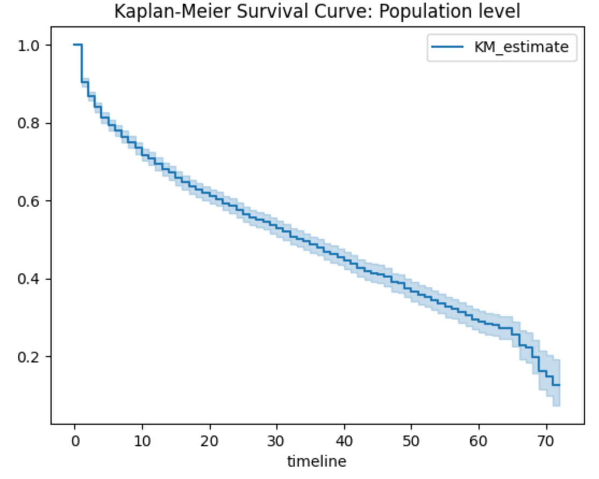
*Figure 1: Overall Kaplan-Meier survival curve*

#### 4.2.2 DSL Internet Service Survival Probability (first 10 months)

| Month | DSL Survival Probability |
|-------|--------------------------|
| 0 | 1.000000 |
| 1 | 0.902698 |
| 2 | 0.864380 |
| 3 | 0.834702 |
| 4 | 0.810522 |
| 5 | 0.794352 |
| 6 | 0.783900 |
| 7 | 0.776362 |
| 8 | 0.768486 |
| 9 | 0.750833 |

#### 4.2.3 Group Survival Analysis Results

1. **Gender**

| Metric | Value |
|--------|-------|
| test_statistic | 2.038938 |
| p-value | 0.153317 |
| -log2(p) | 2.705414 |

- **Conclusion**: p > 0.05, survival curves for different genders are not significantly different

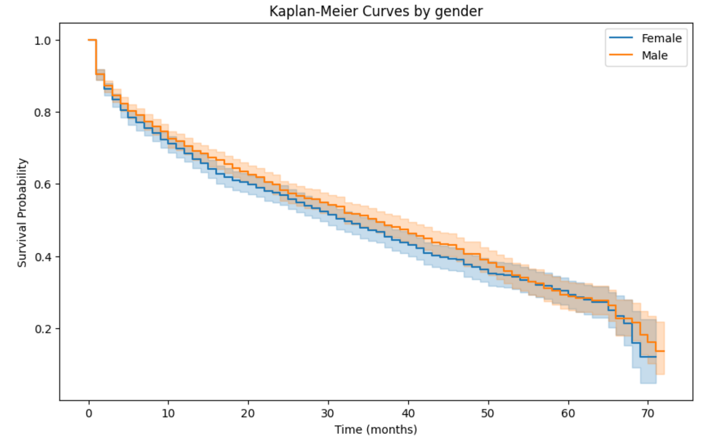
*Figure 2: Survival curve by gender*

---

2. **Senior Citizen Status (seniorCitizen)**

| Metric | Value |
|--------|-------|
| test_statistic | 0.125471 |
| p-value | 0.723174 |
| -log2(p) | 0.467584 |

- **Conclusion**: p > 0.05, senior citizen status has no significant impact on customer retention

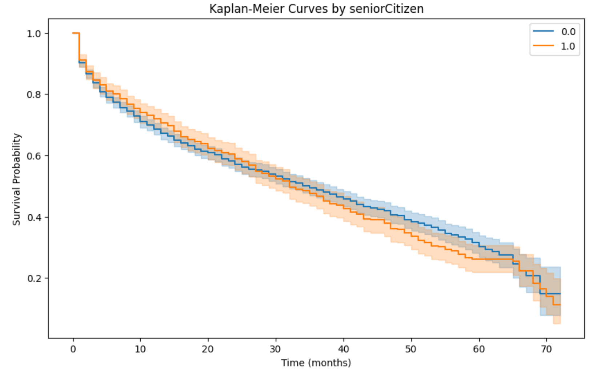
*Figure 3: Survival curve by senior citizen status*

---

3. **Partner Status (partner)**

| Metric | Value |
|--------|-------|
| test_statistic | 135.758896 |
| p-value | 2.252911e-31 |
| -log2(p) | 101.807981 |

- **Conclusion**: Customers with partners have significantly longer retention time

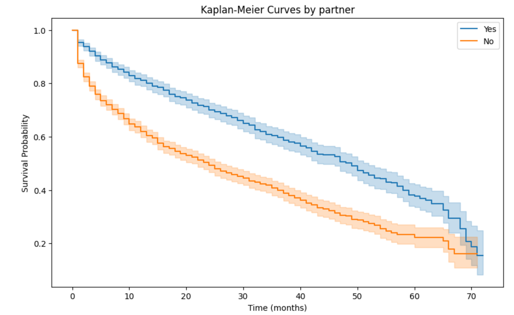
*Figure 4: Survival curve by partner status*

---

4. **Dependents Status (dependents)**

| Metric | Value |
|--------|-------|
| test_statistic | 35.031241 |
| p-value | 3.244576e-09 |
| -log2(p) | 28.199323 |

- **Conclusion**: Customers with dependents have significantly longer retention time

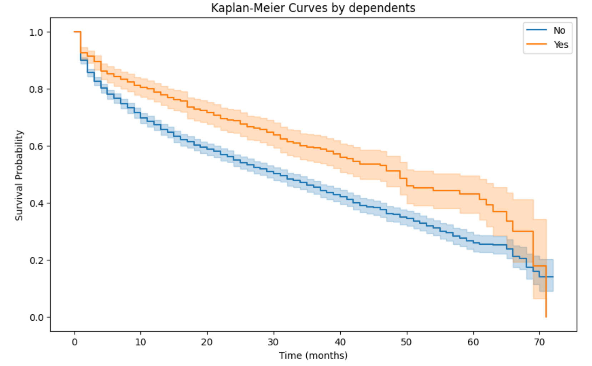
*Figure 5: Survival curve by dependents status*

---

5. **Phone Service (phoneService)**

| Metric | Value |
|--------|-------|
| test_statistic | 1.683709 |
| p-value | 0.194432 |
| -log2(p) | 2.36266 |

- **Conclusion**: p > 0.05, having phone service has no significant impact on retention

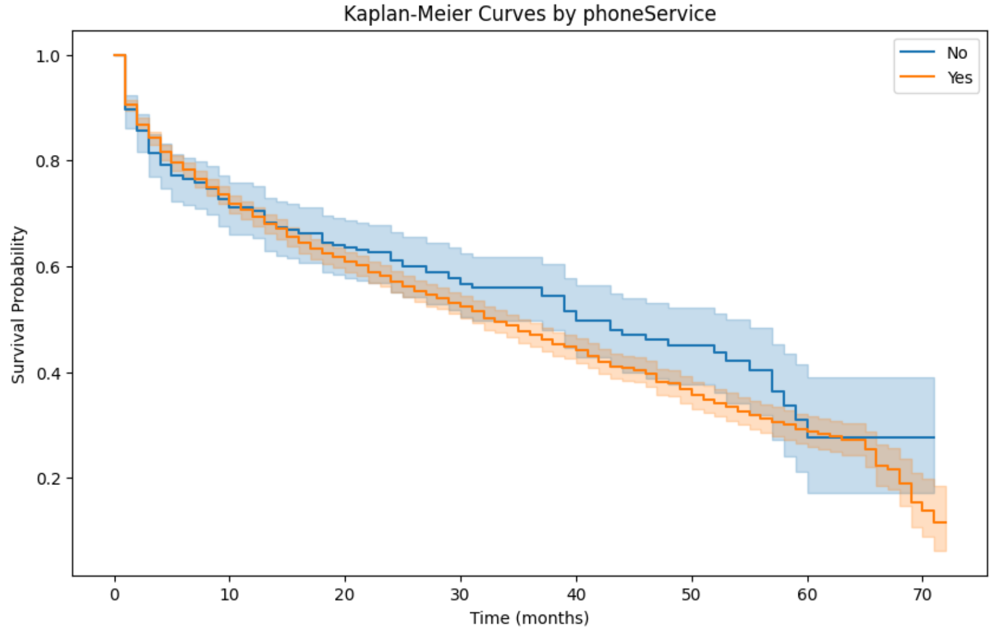
*Figure 6: Survival curve by phone service*

---

6. **Multiple Lines Service (multipleLines)**

| Group Comparison | test_statistic | p-value |
|-----------------|----------------|---------|
| No phone service vs No | 12.382712 | 4.333273e-04 |
| No vs Yes | 72.358368 | 1.794602e-17 |
| No phone service vs Yes | 1.500291 | 0.2206266 |

- **Conclusion**: Multiple lines service has a significant impact on retention

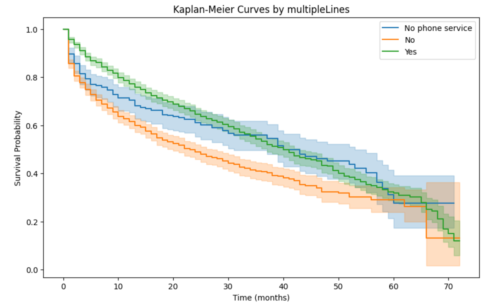
*Figure 7: Survival curve by multiple lines service*

---

7. **Internet Service Type (internetService)**

| Metric | Value |
|--------|-------|
| test_statistic | 25.172866 |
| p-value | 5.241449e-07 |
| -log2(p) | 20.863531 |

- **Conclusion**: DSL customers retain significantly better than fiber optic customers

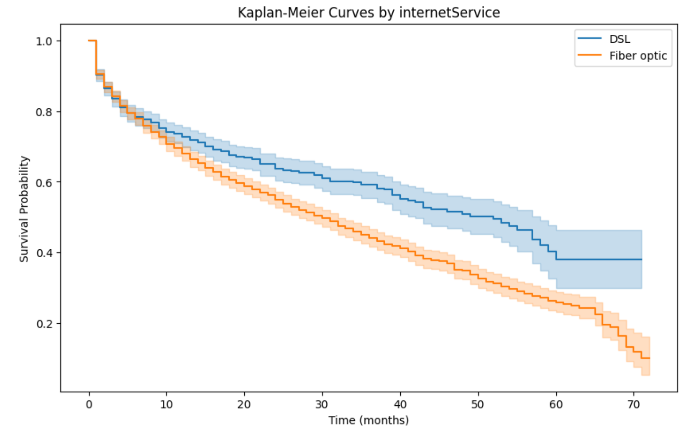
*Figure 8: Survival curve by internet service type*

---

8. **Streaming TV (streamingTV)**

| Metric | Value |
|--------|-------|
| test_statistic | 12.93926 |
| p-value | 0.000322 |
| -log2(p) | 11.601718 |

- **Conclusion**: Customers with streaming TV service retain significantly better

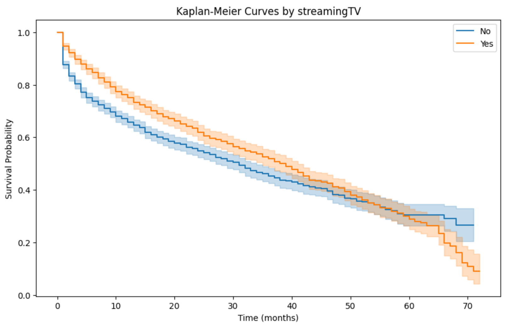
*Figure 9: Survival curve by streaming TV*

---

9. **Streaming Movies (streamingMovies)**

| Metric | Value |
|--------|-------|
| test_statistic | 17.941685 |
| p-value | 0.000023 |
| -log2(p) | 15.422016 |

- **Conclusion**: Customers with streaming movies service retain significantly better

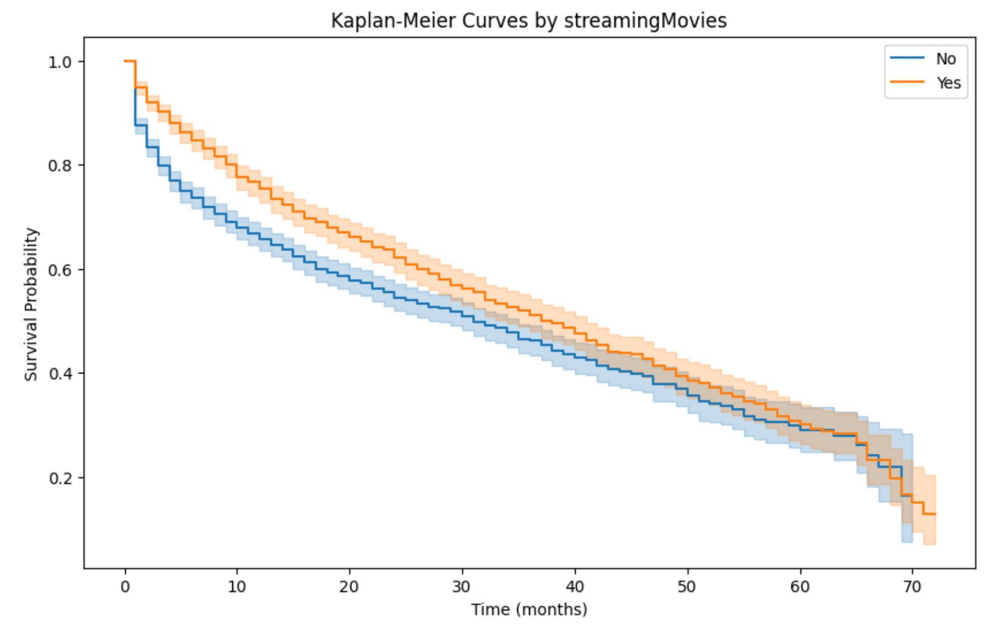
*Figure 10: Survival curve by streaming movies*

---

10. **Online Security Service (onlineSecurity)**

| Metric | Value |
|--------|-------|
| test_statistic | 141.60316 |
| p-value | 1.187554e-32 |
| -log2(p) | 106.053706 |

- **Conclusion**: Customers with online security service have significantly longer retention time

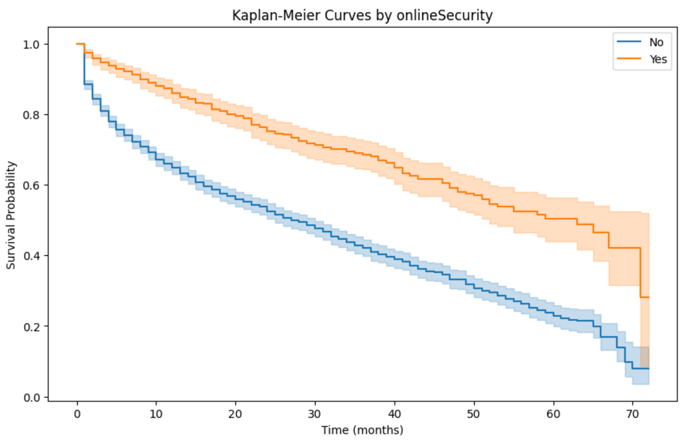
*Figure 11: Survival curve by online security*

---

11. **Online Backup Service (onlineBackup)**

| Metric | Value |
|--------|-------|
| test_statistic | 189.482865 |
| p-value | 4.122979e-43 |
| -log2(p) | 140.799221 |

- **Conclusion**: Customers with online backup service have significantly longer retention time

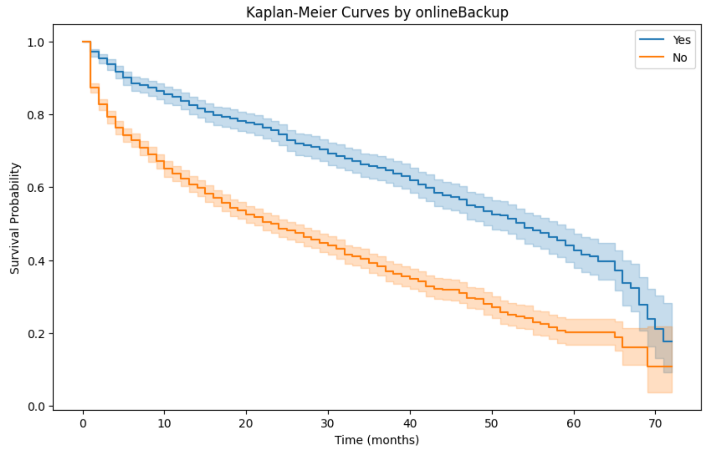
*Figure 12: Survival curve by online backup*

---

12. **Device Protection Service (deviceProtection)**

| Metric | Value |
|--------|-------|
| test_statistic | 71.496825 |
| p-value | 2.777047e-17 |
| -log2(p) | 54.999226 |

- **Conclusion**: Customers with device protection service have significantly longer retention time

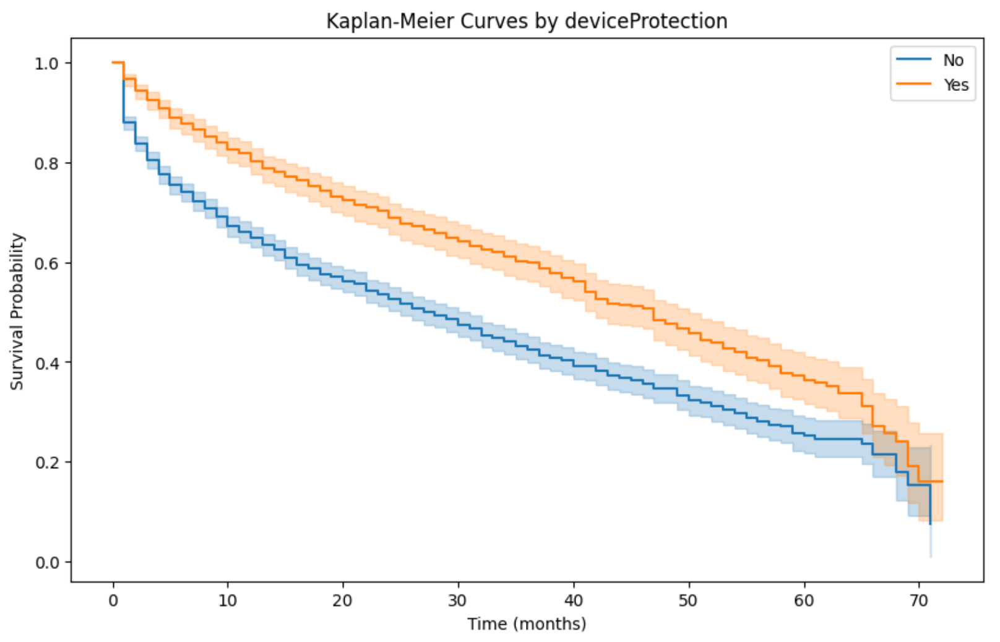
*Figure 13: Survival curve by device protection*

---

13. **Tech Support Service (techSupport)**

| Metric | Value |
|--------|-------|
| test_statistic | 90.430334 |
| p-value | 1.916059e-21 |
| -log2(p) | 68.822348 |

- **Conclusion**: Customers with tech support service have significantly longer retention time

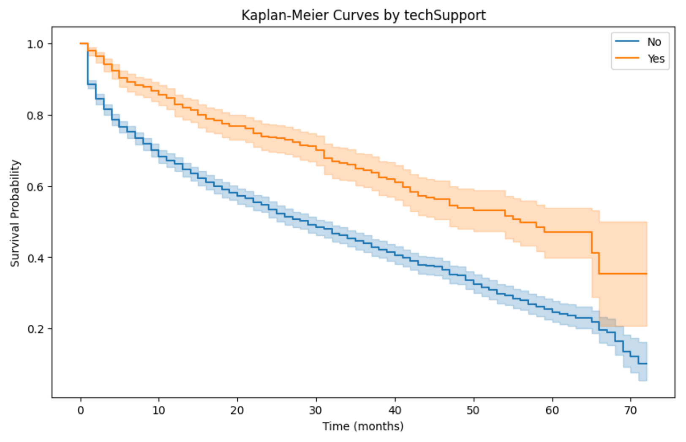
*Figure 14: Survival curve by tech support*

---

14. **Paperless Billing (paperlessBilling)**

| Metric | Value |
|--------|-------|
| test_statistic | 8.340802 |
| p-value | 0.003876 |
| -log2(p) | 8.011049 |

- **Conclusion**: Customers using paperless billing have higher churn risk

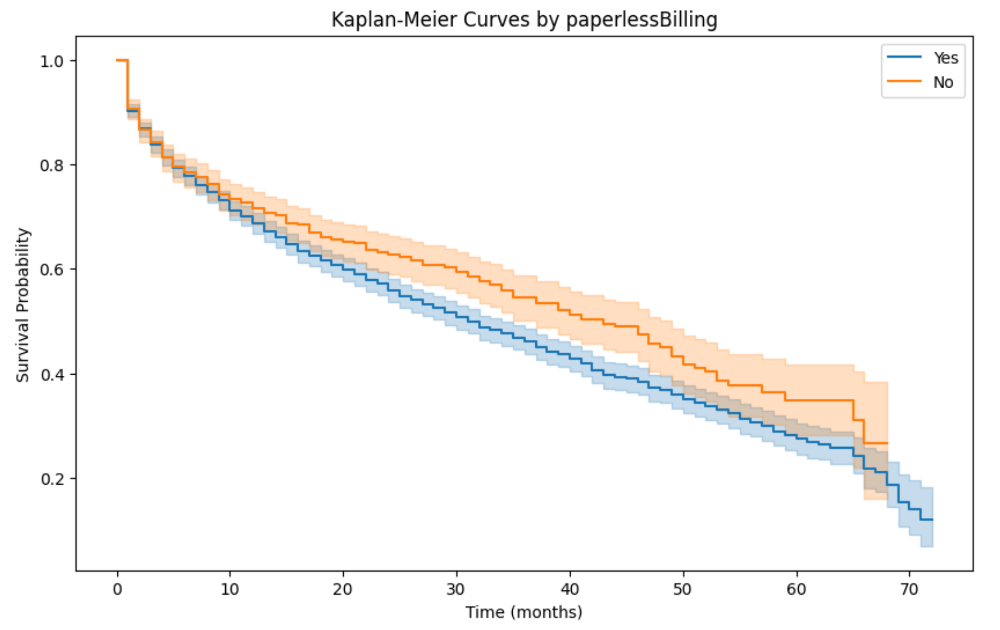
*Figure 15: Survival curve by paperless billing*

---

15. **Payment Method (paymentMethod)**
- **Conclusion**: Payment method has a highly significant impact on retention; electronic check is a high-risk payment method

| Group Comparison | test_statistic | p-value | -log2(p) |
|-----------------|----------------|---------|----------|
| Bank transfer (automatic) vs Credit card (automatic) | 0.061543 | 8.040732e-01 | 0.314601 |
| Bank transfer (automatic) vs Electronic check | 91.191889 | 1.303937e-21 | 69.377616 |
| Bank transfer (automatic) vs Mailed check | 43.536998 | 4.160192e-11 | 34.484559 |
| Credit card (automatic) vs Electronic check | 79.991082 | 3.761035e-19 | 61.205504 |
| Credit card (automatic) vs Mailed check | 39.684613 | 2.984678e-10 | 31.641706 |
| Electronic check vs Mailed check | 0.898320 | 3.432326e-01 | 1.542741 |

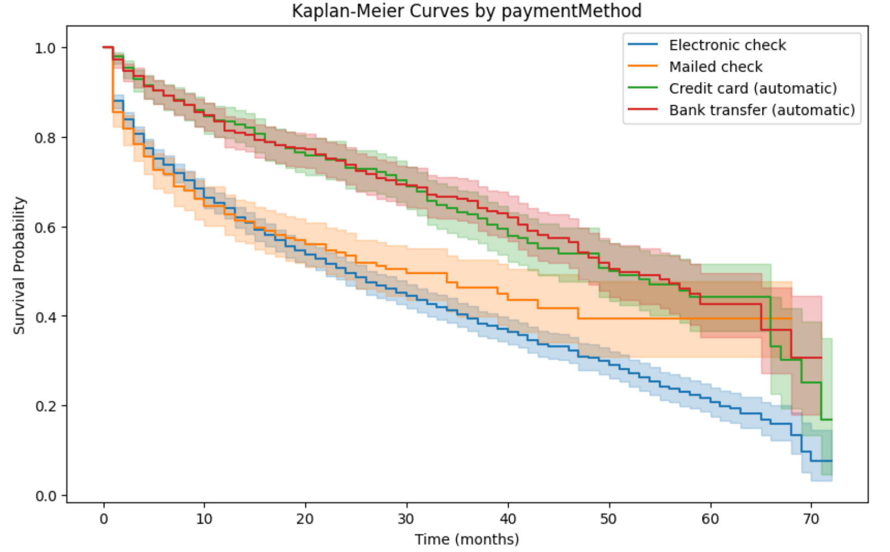
*Figure 16: Survival curve by payment method*

#### 4.2.4 Key Findings

1. **Overall customer retention level**  
   The target customer segment has a median survival time of 34 months, meaning 50% of customers churn within 34 months of joining the network, indicating a relatively high overall churn risk.

2. **Factors with no significant impact on retention**  
   Gender, senior citizen status, and phone service subscription do not significantly affect customer retention (p > 0.05).

3. **Protective services that significantly extend customer retention**  
   Online backup, online security, tech support, and device protection all significantly reduce churn risk, with:  
   - Online backup having the strongest effect (log-rank statistic as high as 189.48)  
   - Online security second  
   - Tech support also being a core protective factor

4. **Service type differences**  
   - DSL customers retain significantly better than fiber optic customers; fiber optic customers are a key churn concern.  
   - Customers with streaming TV and streaming movies have significantly better retention.

5. **Impact of customer personal characteristics**  
   Customers with partners or dependents have lower churn risk; family-type customers are more stable.

6. **Billing and payment method risk signals**  
   - Customers using paperless billing have higher churn risk.  
   - Electronic check payment is the highest-risk payment method; automatic deductions (bank transfer/credit card) yield the best retention.

7. **Summary of high-risk customer profile**  
   Customers without a partner, without dependents, using fiber optic internet service, not purchasing value-added services (security/backup/tech support/device protection), and paying by electronic check are the highest churn risk group in this analysis.

---

## 5. Cox Proportional Hazards Model

### 5.1 Analysis Workflow

```python
from lifelines import CoxPHFitter

# Data preparation and One-Hot encoding
encode_cols = ['dependents', 'internetService', 'onlineBackup', 'techSupport', 'paperlessBilling']
encoded_pd = pd.get_dummies(telco_pd, columns=encode_cols, prefix=encode_cols, drop_first=False)

# Select variables
survival_pd = encoded_pd[['churn', 'tenure', 'dependents_Yes', 
                          'internetService_DSL', 'onlineBackup_Yes', 'techSupport_Yes']]

# Fit Cox model
cph = CoxPHFitter(alpha=0.05)
cph.fit(survival_pd, 'tenure', 'churn')

# Output results
cph.print_summary()
cph.plot(hazard_ratios=True)

# Proportional hazards assumption test
cph.check_assumptions(survival_pd, p_value_threshold=0.05)
cph.check_assumptions(survival_pd, p_value_threshold=0.05, show_plots=True)
```

### 5.2 Analysis Results

#### 5.2.1 Model Overview
| Metric | Value |
|--------|-------|
| model | lifelines.CoxPHFitter |
| duration col | tenure |
| event col | churn |
| baseline estimation | breslow |
| number of observations | 3351 |
| number of events observed | 1556 |
| partial log-likelihood | -11315.95 |
| Concordance | 0.64 |
| Partial AIC | 22639.90 |
| log-likelihood ratio test | 337.77 (df=4) |
| -log2(p) of ll-ratio test | 236.24 |

#### 5.2.2 Model Coefficients and Hazard Ratio Analysis

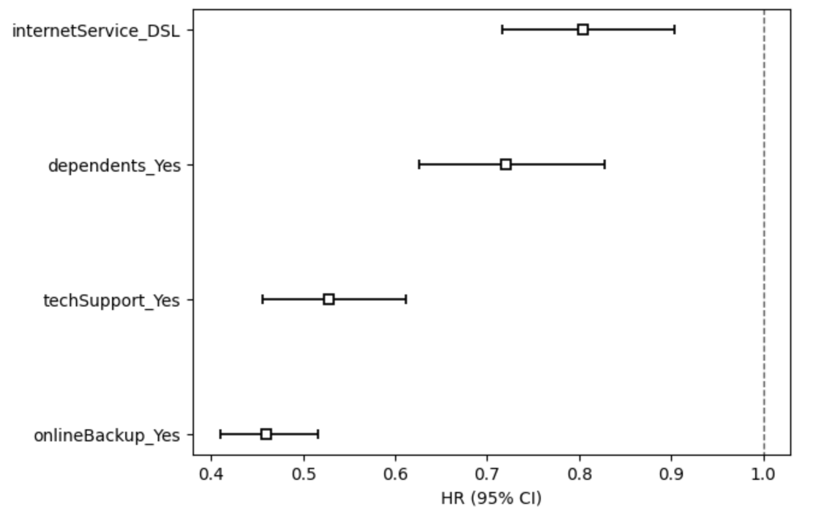
*Figure 17: Cox model hazard ratios (HR<1 indicates protective factor, with 95% CI)*

| Variable | coef | exp(coef) | se(coef) | coef 95% CI | exp(coef) 95% CI | z | p-value | -log2(p) | Significance |
|----------|------|-----------|----------|------------|-----------------|----|---------|----------|--------------|
| dependents_Yes | -0.33 | 0.72 | 0.07 | [-0.47, -0.19] | [0.63, 0.83] | -4.64 | <0.005 | 18.12 | *** |
| internetService_DSL | -0.22 | 0.80 | 0.06 | [-0.33, -0.10] | [0.72, 0.90] | -3.68 | <0.005 | 12.07 | *** |
| onlineBackup_Yes | -0.78 | 0.46 | 0.06 | [-0.89, -0.66] | [0.41, 0.52] | -13.13 | <0.005 | 128.37 | *** |
| techSupport_Yes | -0.64 | 0.53 | 0.08 | [-0.79, -0.49] | [0.46, 0.61] | -8.48 | <0.005 | 55.36 | *** |

**Significance markers**: *** p<0.001, ** p<0.01, * p<0.05*

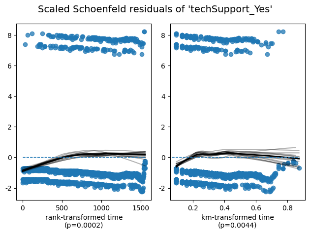
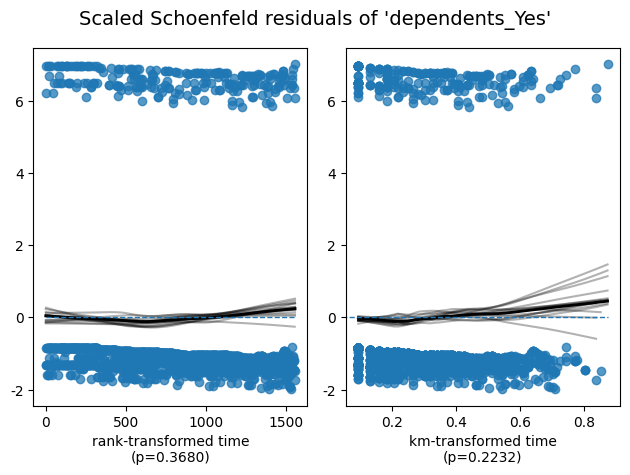
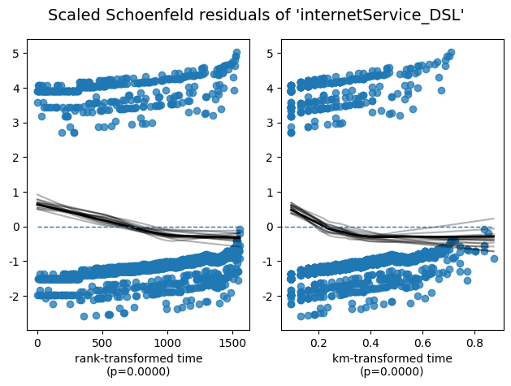
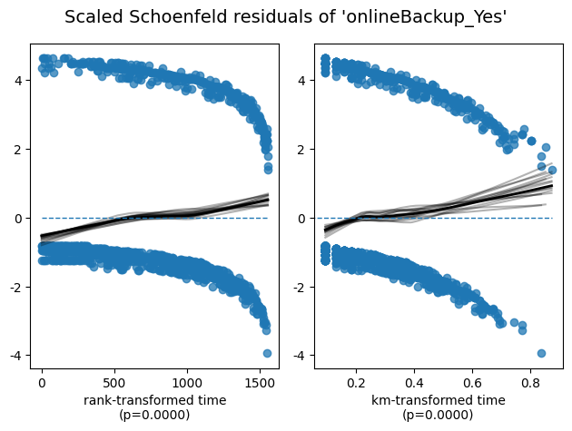  
*Figure 18: Scaled Schoenfeld residual plots for each variable (with both rank and km time transformation methods)*

#### 5.2.3 Proportional Hazards Assumption Test Results

| Variable | Test Method | Test Statistic | p-value | -log2(p) | Assumption Check |
|----------|-------------|----------------|---------|----------|------------------|
| dependents_Yes | km | 1.48 | 0.22 | 2.16 | Pass |
| dependents_Yes | rank | 0.81 | 0.37 | 1.44 | Pass |
| internetService_DSL | km | 20.98 | <0.005 | 17.72 | Violated |
| internetService_DSL | rank | 26.71 | <0.005 | 22.01 | Violated |
| onlineBackup_Yes | km | 17.80 | <0.005 | 15.31 | Violated |
| onlineBackup_Yes | rank | 17.47 | <0.005 | 15.07 | Violated |
| techSupport_Yes | km | 8.09 | <0.005 | 7.81 | Violated |
| techSupport_Yes | rank | 13.76 | <0.005 | 12.23 | Violated |

The following variables violate the proportional hazards assumption:  
1. **internetService_DSL**: p-value < 5e-05  
2. **onlineBackup_Yes**: p-value < 5e-05  
3. **techSupport_Yes**: p-value = 0.0002  

**Remedial suggestion**: When modeling, use `strata=['internetService_DSL', 'onlineBackup_Yes', 'techSupport_Yes']` to stratify variables that violate the assumption, improving model reliability.

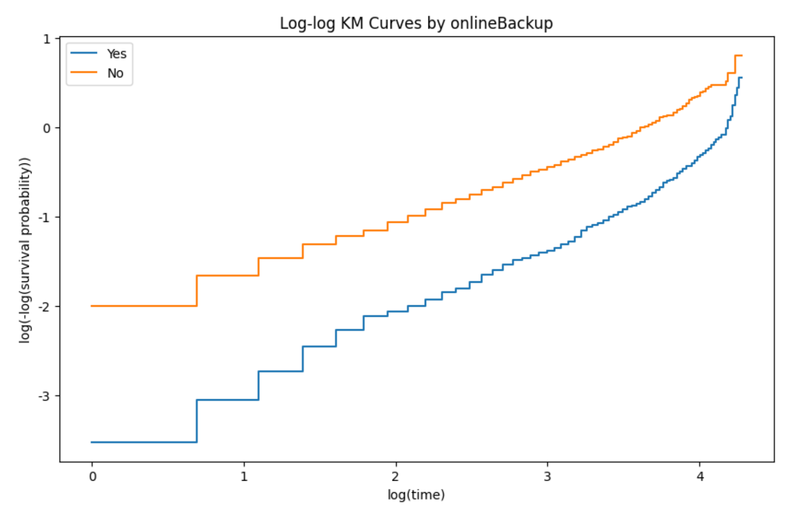
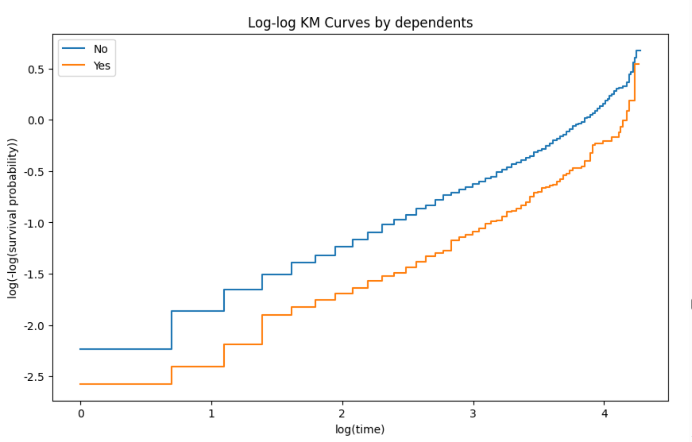
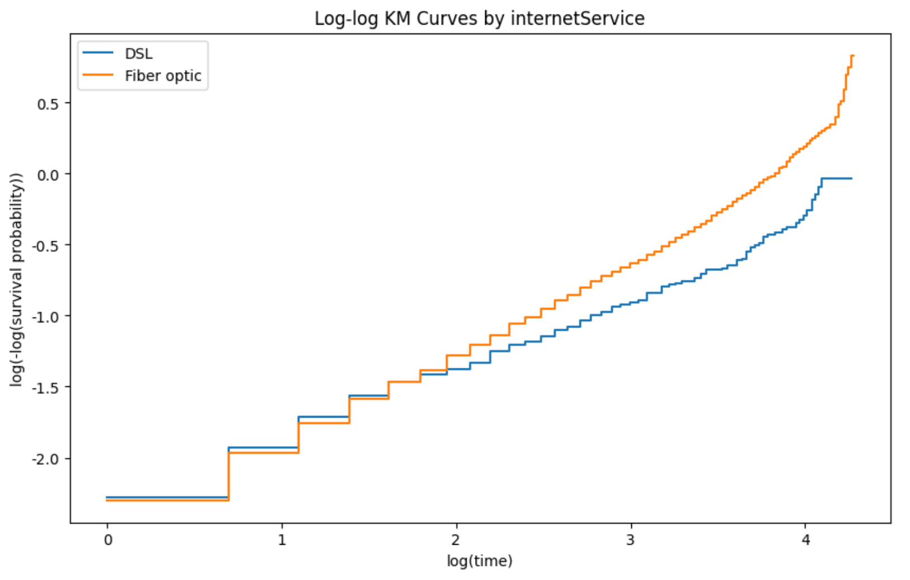
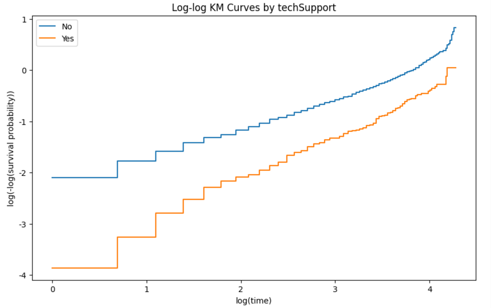  
*Figure 19: Log-log Kaplan-Meier curves for each variable group, used to visually verify the proportional hazards assumption*

#### 5.2.4 Key Findings
1. **Protective factors (reducing customer churn risk)**  
   All variables included in this model are protective factors against customer churn, ordered by effect strength as follows:  
   - **onlineBackup_Yes**: HR=0.46, reduces customer churn risk by 54.0% (p<0.001) – strongest churn inhibition factor  
   - **techSupport_Yes**: HR=0.53, reduces customer churn risk by 47.2% (p<0.001)  
   - **dependents_Yes**: HR=0.72, reduces customer churn risk by 28.0% (p<0.001)  
   - **internetService_DSL**: HR=0.80, reduces customer churn risk by 19.5% (p<0.001)  

2. **Risk factors**  
   In the Cox regression model constructed in this study, no risk factors with HR>1.2 and statistical significance were identified. All included features showed a positive effect on customer retention.

---

## 6. Accelerated Failure Time Model (AFT)

### 6.1 Analysis Workflow

```python
from lifelines import LogLogisticAFTFitter

# Data preparation and One-Hot encoding
encode_cols = ['partner', 'multipleLines', 'internetService', 'onlineSecurity', 
               'onlineBackup', 'deviceProtection', 'techSupport', 'paymentMethod']
encoded_pd = pd.get_dummies(telco_pd, columns=encode_cols, prefix=encode_cols, drop_first=False)

# Select variables
survival_pd = encoded_pd[['churn', 'tenure', 'partner_Yes', 'multipleLines_Yes',
                          'internetService_DSL', 'onlineSecurity_Yes', 'onlineBackup_Yes',
                          'deviceProtection_Yes', 'techSupport_Yes',
                          'paymentMethod_Bank transfer (automatic)',
                          'paymentMethod_Credit card (automatic)']]

# Fit LogLogistic AFT model
aft = LogLogisticAFTFitter()
aft.fit(survival_pd, duration_col='tenure', event_col='churn')

# Output results
print(f"Median Survival Time:{np.exp(aft.median_survival_time_):.2f}")
aft.print_summary()
aft.plot()
```

### 6.2 Analysis Results

#### 6.2.1 Model Results

| Metric | Value |
|--------|-------|
| model | lifelines.LogLogisticAFTFitter |
| duration col | tenure |
| event col | churn |
| baseline estimation | breslow |
| number of observations | 3351 |
| number of events observed | 1556 |
| log-likelihood | -6838.36 |
| Concordance | 0.73 |
| AIC | 13698.72 |
| log-likelihood ratio test | 877.49 (df=9) |
| -log2(p) of ll-ratio test | 605.78 |

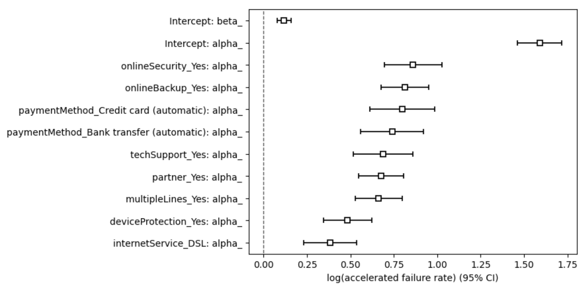
*Figure 20: AFT model coefficients and confidence intervals*

#### 6.2.2 AFT Model Coefficient Table

| Variable | coef | exp(coef) | se(coef) | z | p | -log2(p) |
|----------|------|-----------|----------|---|----|----------|
| deviceProtection_Yes | 0.48 | 1.62 | 0.07 | 6.88 | <0.005 | - |
| internetService_DSL | 0.38 | 1.47 | 0.08 | 4.98 | <0.005 | - |
| multipleLines_Yes | 0.66 | 1.94 | 0.07 | 9.64 | <0.005 | - |
| onlineBackup_Yes | 0.81 | 2.25 | 0.07 | 11.63 | <0.005 | - |
| onlineSecurity_Yes | 0.86 | 2.37 | 0.09 | 10.12 | <0.005 | - |
| partner_Yes | 0.68 | 1.97 | 0.07 | 10.21 | <0.005 | - |
| paymentMethod_Bank transfer | 0.74 | 2.10 | 0.09 | 8.05 | <0.005 | - |
| paymentMethod_Credit card | 0.80 | 2.22 | 0.10 | 8.36 | <0.005 | - |
| techSupport_Yes | 0.69 | 1.99 | 0.09 | 7.90 | <0.005 | - |
| Intercept | 1.59 | 4.91 | 0.07 | 24.47 | <0.005 | - |
| beta_Intercept | 0.12 | 1.13 | 0.02 | 5.71 | <0.005 | - |

#### 6.2.3 Model Assumption Verification - Log-odds Plots

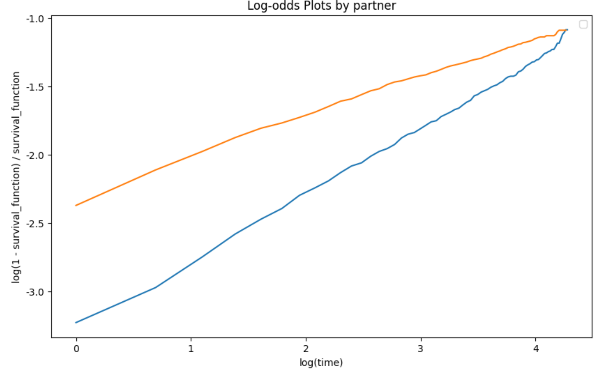
*Figure 21: Log-odds plot (partner)*

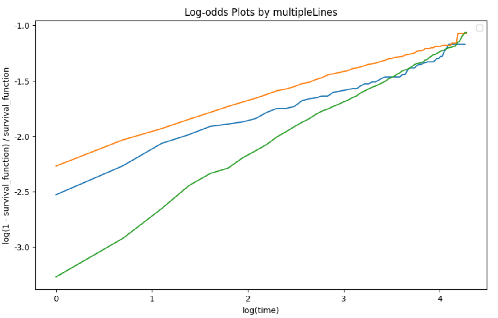
*Figure 22: Log-odds plot (multipleLines)*

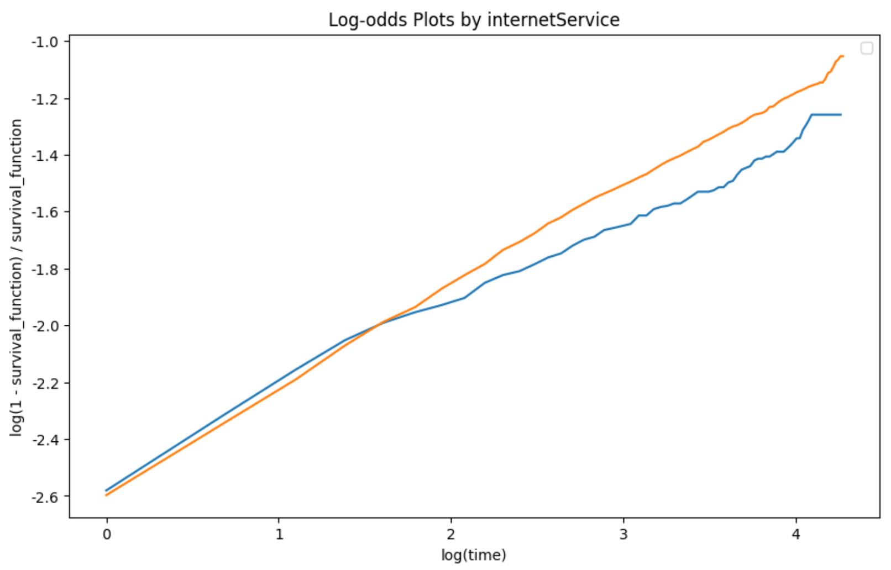
*Figure 23: Log-odds plot (internetService)*

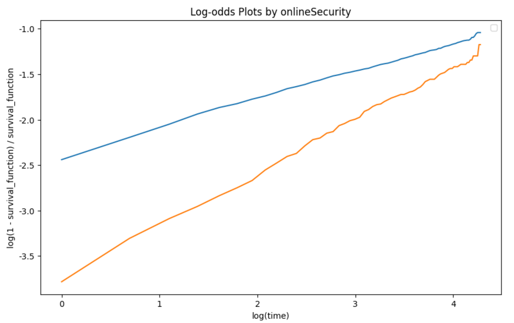
*Figure 24: Log-odds plot (onlineSecurity)*

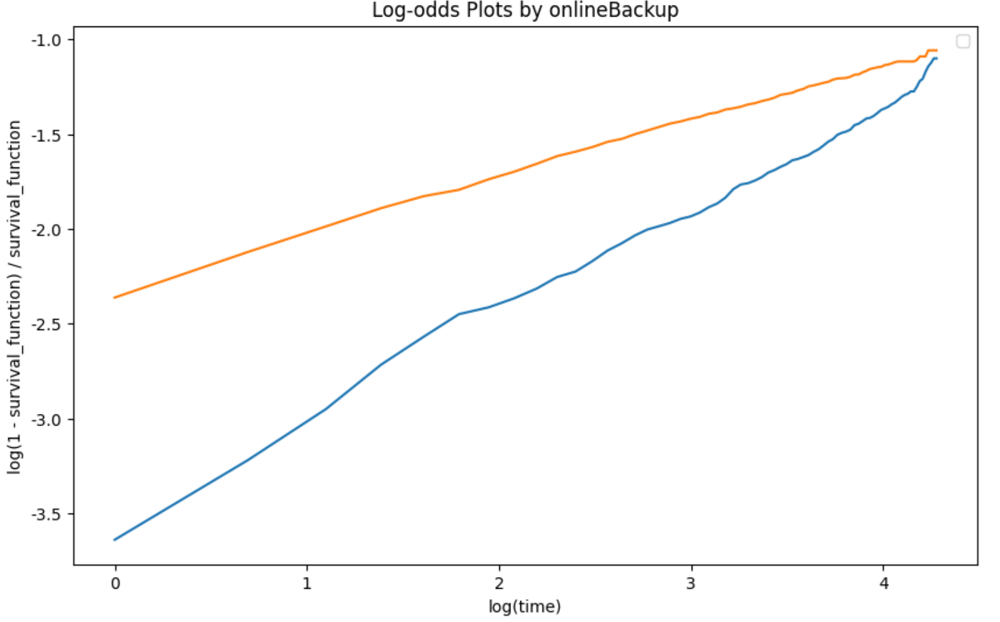
*Figure 25: Log-odds plot (onlineBackup)*

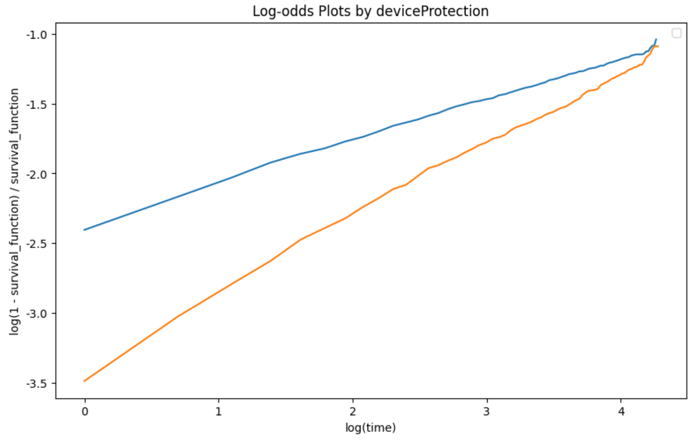
*Figure 26: Log-odds plot (deviceProtection)*

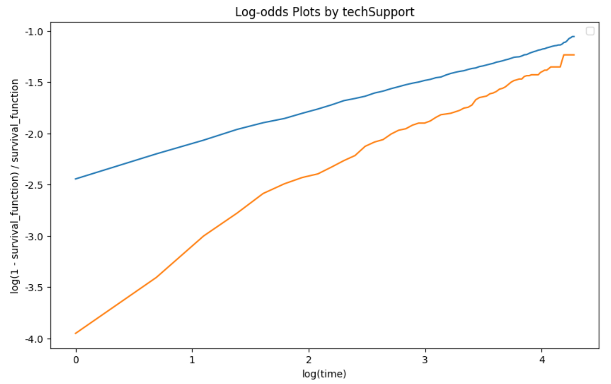
*Figure 27: Log-odds plot (techSupport)*

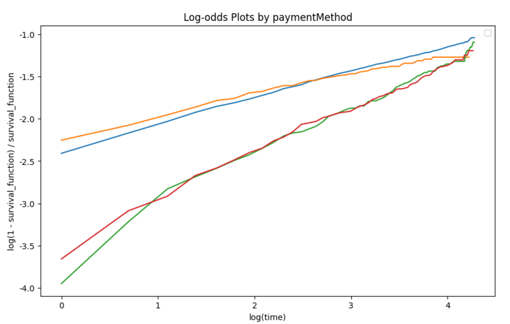
*Figure 28: Log-odds plot (paymentMethod)*

#### 6.2.4 Reliability Warnings
- **Warning 1**: Predicted value (135.5) exceeds 1.5 times the data range (72.0)
- **Warning 2**: Large discrepancy from Kaplan-Meier result (34.0), ratio = 3.99

#### 6.2.5 Recommendation
**Do not use AFT model results for business decisions. Use Kaplan-Meier results (34 months) instead.**

---

## 7. Customer Lifetime Value (CLV)

### 7.1 Calculation Workflow

```python
def calculate_customer_lifetime_value(cph, monthly_profit=30, discount_rate=0.10):
    # Define baseline customer
    baseline_customer = pd.DataFrame([{
        'dependents_Yes': 0, 'internetService_DSL': 0,
        'onlineBackup_Yes': 0, 'techSupport_Yes': 0
    }])
    
    irr = discount_rate / 12
    survival_func = cph.predict_survival_function(baseline_customer)
    
    # Build cohort table
    cohort_df = pd.concat([pd.DataFrame([1.00]), round(survival_func, 2)])
    cohort_df = cohort_df.rename(columns={0: 'Survival Probability'})
    cohort_df['Contract Month'] = cohort_df.index.astype('int')
    cohort_df['Monthly Profit for the Selected Plan'] = monthly_profit
    cohort_df['Avg Expected Monthly Profit'] = round(cohort_df['Survival Probability'] * monthly_profit, 2)
    cohort_df['NPV of Avg Expected Monthly Profit'] = round(
        cohort_df['Avg Expected Monthly Profit'] / ((1 + irr) ** cohort_df['Contract Month']), 2
    )
    cohort_df['Cumulative NPV'] = cohort_df['NPV of Avg Expected Monthly Profit'].cumsum()
    cohort_df['Contract Month'] = cohort_df['Contract Month'] + 1
    
    return cohort_df.set_index('Contract Month')
```

### 7.2 Calculation Results

#### 7.2.1 Calculation Parameters
- **Monthly profit per customer**: $30
- **Annual discount rate**: 10%
- **Monthly discount rate**: 0.83%
- **Forecast time horizon**: 72 months

#### 7.2.2 CLV Key Node Results

| Time Horizon | Cumulative NPV (CLV) |
|--------------|----------------------|
| 12 months | $266.88 |
| 24 months | $405.44 |
| 36 months | $515.01 |
| Lifetime CLV | $626.69 |

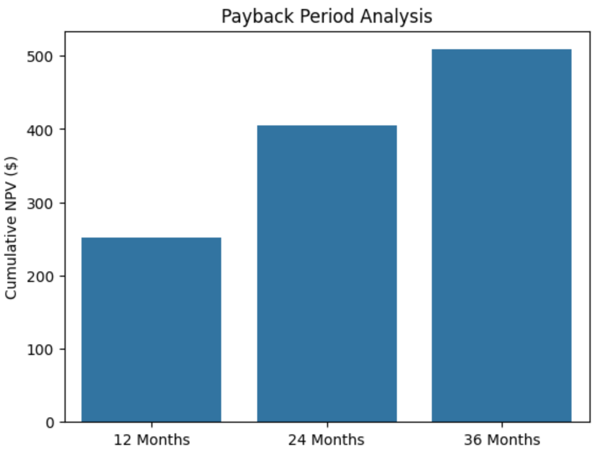
*Figure 29: Payback period analysis*

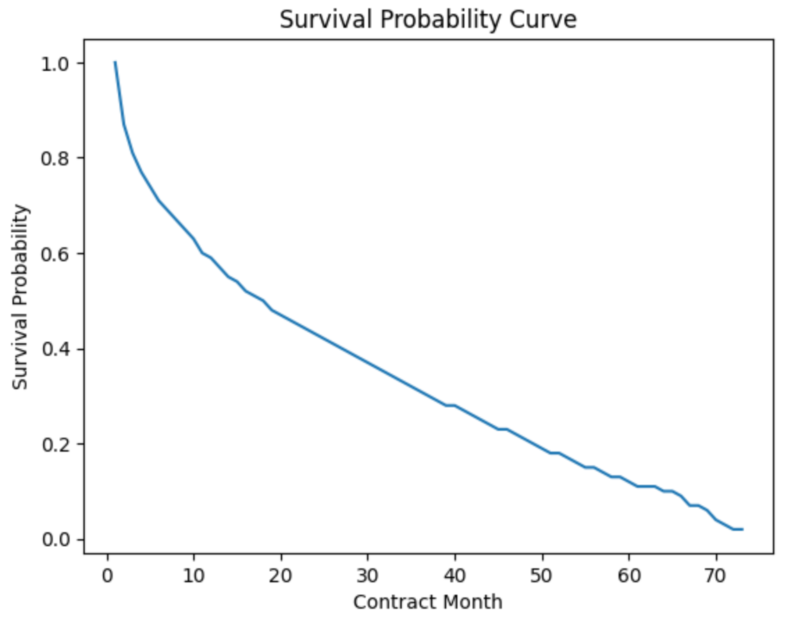
*Figure 30: Survival probability curve*

#### 7.2.3 CLV Trend Table (complete data for first 25 months)

| Contract Month | Survival Probability | Monthly Profit | Avg Expected Monthly Profit | NPV | Cumulative NPV |
|----------------|---------------------|----------------|-----------------------------|-----|----------------|
| 1 | 1.00 | 30 | 30.00 | 30.00 | 30.00 |
| 2 | 0.87 | 30 | 26.10 | 25.88 | 55.88 |
| 3 | 0.81 | 30 | 24.30 | 23.90 | 79.78 |
| 4 | 0.77 | 30 | 23.10 | 22.53 | 102.31 |
| 5 | 0.74 | 30 | 22.20 | 21.48 | 123.79 |
| 6 | 0.71 | 30 | 21.30 | 20.43 | 144.22 |
| 7 | 0.69 | 30 | 20.70 | 19.69 | 163.91 |
| 8 | 0.67 | 30 | 20.10 | 18.97 | 182.88 |
| 9 | 0.65 | 30 | 19.50 | 18.25 | 201.13 |
| 10 | 0.63 | 30 | 18.90 | 17.54 | 218.67 |
| 11 | 0.60 | 30 | 18.00 | 16.57 | 235.24 |
| 12 | 0.59 | 30 | 17.70 | 16.16 | 251.40 |
| 13 | 0.57 | 30 | 17.10 | 15.48 | 266.88 |
| 14 | 0.55 | 30 | 16.50 | 14.81 | 281.69 |
| 15 | 0.54 | 30 | 16.20 | 14.42 | 296.11 |
| 16 | 0.52 | 30 | 15.60 | 13.77 | 309.88 |
| 17 | 0.51 | 30 | 15.30 | 13.40 | 323.28 |
| 18 | 0.50 | 30 | 15.00 | 13.03 | 336.31 |
| 19 | 0.48 | 30 | 14.40 | 12.40 | 348.71 |
| 20 | 0.47 | 30 | 14.10 | 12.04 | 360.75 |
| 21 | 0.46 | 30 | 13.80 | 11.69 | 372.44 |
| 22 | 0.45 | 30 | 13.50 | 11.34 | 383.78 |
| 23 | 0.44 | 30 | 13.20 | 11.00 | 394.78 |
| 24 | 0.43 | 30 | 12.90 | 10.66 | 405.44 |
| 25 | 0.42 | 30 | 12.60 | 10.32 | 415.76 |

#### 7.2.4 Key Findings
1. **Customer Lifetime Value (CLV)**: The cumulative net present value (NPV) for the baseline customer over 72 months is **$626.69**, a core reference metric for setting customer acquisition cost limits.
2. **Revenue growth trend**: Customer CLV grows rapidly to $266.88 in the first 12 months, to $405.44 by 24 months, and reaches $515.01 by 36 months, then growth slows, indicating the early period is critical for value contribution.
3. **Survival probability decay**: Customer survival probability continuously declines over time, from 1.00 in the first month to 0.43 by 24 months, reflecting the long-term trend of customer churn.
4. **Impact of expected profit and discounting**: Due to decaying survival probability and the discount rate, the average expected monthly profit per customer gradually declines from $30.00 in the first month to $12.90 by 24 months, and the growth rate of NPV also slows.
5. **Business decision recommendations**: Customer acquisition cost (CAC) should be controlled within 30% of CLV (approximately $188) to ensure profitability of customer relationships; at the same time, focus on implementing customer retention strategies within the first 24 months to maximize long-term customer value.

---

## 8. Conclusion

### 8.1 Model Applicability and Reliability Assessment

Based on the IBM Telco Customer Churn dataset, this study systematically quantifies churn behavior of month-to-month internet service customers using Kaplan-Meier estimation, Cox proportional hazards regression, Accelerated Failure Time (AFT) models, and the Customer Lifetime Value (CLV) framework. Main model evaluation conclusions are as follows:

| Model | Reliability | Primary Use | Key Output |
|-------|-------------|-------------|-------------|
| Kaplan-Meier estimation | ✅ Highly reliable | Non-parametric survival function estimation | Median survival time: 34 months |
| Cox proportional hazards model | ✅ Reliable | Multi-factor hazard ratio analysis | Concordance Index: 0.64; HR(onlineBackup)=0.46 |
| LogLogistic AFT model | ❌ Unreliable | Parametric survival time prediction | Predicted median survival time 135.5 months (beyond observation range) |
| CLV framework | ✅ Usable | Long-term customer value quantification | 72-month cumulative NPV: $626.69 |

**Overall judgment**: The Kaplan-Meier and Cox models provide robust core analytical conclusions for this study; the AFT model is not suitable for business decisions due to extrapolation beyond supported data range; the CLV framework, while informative, depends on the predictive ability of the Cox model.

### 8.2 Core Empirical Findings

#### (1) Overall customer retention level

The target customer segment (month-to-month + internet service users) has a median survival time of **34 months**. This indicates that 50% of customers in this segment churn within 34 months after joining the network, representing a relatively high overall churn risk.

#### (2) Identification of key protective factors (based on Cox model)

Four variables were identified as significant protective factors, ordered by effect strength:

| Protective Factor | Hazard Ratio (HR) | Reduction in Churn Risk | Statistical Significance |
|------------------|-------------------|-------------------------|--------------------------|
| onlineBackup_Yes | 0.46 | 54.0% | p < 0.001 |
| techSupport_Yes | 0.53 | 47.2% | p < 0.001 |
| dependents_Yes | 0.72 | 28.0% | p < 0.001 |
| internetService_DSL | 0.80 | 19.5% | p < 0.001 |

These results indicate that online backup and tech support services are the two most effective interventions for reducing customer churn risk. The Cox model's Concordance Index is 0.64, indicating moderate discriminative ability.

#### (3) High-risk customer profile

Combining KM group analysis and marginal effects from the Cox model, high-risk churn customers exhibit the following typical characteristics:

- **Demographic characteristics**: No partner, no dependents
- **Service usage characteristics**: Use fiber optic internet service, not subscribed to value-added services such as online backup/online security/device protection/tech support
- **Payment behavior characteristics**: Pay by electronic check, use paperless billing

Log-rank test results show that the between-group difference for partner status is 135.76 (p < 2.25e-31), for dependents is 35.03 (p < 3.24e-09), and for fiber vs. DSL users is 25.17 (p < 5.24e-07), all statistically significant.

#### (4) Customer Lifetime Value (CLV)

The 72-month cumulative NPV for the baseline customer (not subscribed to any value-added services) predicted by the Cox model is **$626.69**. Of this, the first 12 months contribute $266.88 (42.6% of total value), and the first 24 months contribute $405.44 (64.7% of total value), indicating that customer value is concentrated in the first two years after joining.

### 8.3 Summary of Methodological Limitations

- **Unreliability of the AFT model**: The LogLogistic AFT model predicted a median survival time (135.5 months) significantly exceeding the actual observed range (0–72 months), with a ratio of 3.99 compared to the KM estimate (34 months). This deviation arises from the combination of high censoring rate and insufficient observation window, limiting the model's extrapolation ability.
- **Partial violation of proportional hazards assumption**: In the Cox model, the variables `internetService_DSL`, `onlineBackup_Yes`, and `techSupport_Yes` did not pass the proportional hazards test (p < 0.05), suggesting that the effects of these variables may change over time. Stratified Cox or time-varying covariate models are recommended to address this.
- **Sample selection bias**: This study includes only month-to-month contract customers who subscribe to internet services. Conclusions cannot be directly generalized to long-term contract customers or those without internet service.

---

## 9. Business Recommendations

### 9.1 Short-term Operational Strategies (0–6 months)

#### (1) Value-added service promotion plan

Based on the hazard ratio estimates from the Cox model, online backup (HR=0.46) and tech support (HR=0.53) are the most effective risk mitigation tools. Recommendations:

- Implement **bundling strategies** for new customers, offering online backup and tech support as default add-ons to internet service with a first-month free trial.
- Conduct **targeted marketing campaigns** for existing high-risk customers (fiber users, those without partners/dependents) via email, in-app notifications, etc., to promote these services.
- Establish an **A/B testing framework** to quantify the causal effect of interventions on retention.

#### (2) Early identification of high-risk customers

Based on median survival time differences from KM group analysis:

| Risk Dimension | High-risk Group | Low-risk Group | Median Survival Time Difference |
|----------------|----------------|----------------|--------------------------------|
| Partner status | No partner (24 months) | With partner (49 months) | 25 months |
| Dependents status | No dependents (25 months) | With dependents (48 months) | 23 months |
| Internet service | Fiber (30 months) | DSL (52 months) | 22 months |
| Tech support | No (29 months) | Yes (56 months) | 27 months |

It is recommended to embed the above four high-risk labels into the **real-time risk scoring engine** of the CRM system, setting up automated retention intervention nodes at months 6, 12, and 18 after customer onboarding.

### 9.2 Medium-term Strategy Optimization (6–12 months)

#### (1) Customer stratification and refined operations

Based on the risk score (linear predictor = β̂ᵀX) output by the Cox model, divide customers into three risk tiers:

| Risk Tier | Risk Score Percentile | Suggested Intervention | Expected Resource Investment |
|-----------|-----------------------|------------------------|------------------------------|
| Low risk | < 25% | Routine service maintenance | Low |
| Medium risk | 25%–75% | Quarterly service follow-up, coupon推送 | Medium |
| High risk | > 75% | Dedicated account manager, personalized retention plan | High |

#### (2) Service portfolio optimization

- For fiber optic internet service customers (median survival only 30 months), design **exclusive service packages** including online backup, tech support, and device protection to close the retention gap with DSL users.
- Target **single-person households** (no partner and no dependents) as core intervention subjects; their KM median survival is only 24 months, significantly lower than customers with families.

#### (3) Customer Acquisition Cost (CAC) control

Based on the CLV estimate ($626.69) and the 10% annual discount rate assumption, it is recommended to:

- Control CAC within **30% of CLV**, i.e., not exceeding **$188**.
- Adjust CAC limits by channel according to the average risk score of customers acquired from that channel. Channels with higher risk propensity should have a lower CAC ceiling.

### 9.3 Long-term Strategic Recommendations (12–36 months)

#### (1) Model lifecycle management

- Establish a **quarterly model recalibration mechanism**, incorporating the latest churn data to update Cox model coefficients.
- Expand feature engineering to include **behavioral time-series features** such as customer service interaction records (number of complaints, call duration), bill payment delay days, and plan change history.
- Explore the use of **random survival forests** or **deep survival models** (e.g., DeepSurv) as alternatives to the Cox model to capture non-linear effects and interactions.

#### (2) Retention effectiveness monitoring system

Recommend setting up the following Key Performance Indicators (KPIs) with automated monitoring dashboards:

| KPI | Definition | Update Frequency | Alert Threshold |
|-----|------------|------------------|-----------------|
| Overall median survival time | 50% churn time point estimated by KM | Monthly | Month-over-month decrease > 5% |
| Proportion of high-risk customers | Percentage of customers with risk score > 75th percentile | Weekly | Proportion > 30% |
| Value-added service penetration rate | Subscription rate for online backup/tech support | Monthly | Year-over-year growth < 5% |
| CLV trend | 72-month cumulative NPV for baseline customer | Quarterly | Quarter-over-quarter decrease > 10% |

#### (3) Maximizing customer lifetime value

The CLV trend analysis shows that the first 24 months contribute 64.7% of total value. Therefore:

- **Front-load retention resources** in the first two years after onboarding, implementing the highest-intensity interventions during this period.
- Set up **key touchpoints** at months 12 and 24 to enhance renewal rates at those times through personalized offers, service upgrade recommendations, etc.
- For long-standing customers who have been active for more than 36 months, reduce retention resource investment and transition them into a low-maintenance "stable period" management.

---

## 10. Model Limitations and Improvement Directions

### 10.1 Reasons for AFT Model Prediction Failure

The LogLogistic AFT model used in this study predicted a median survival time (135.5 months) that significantly deviates from the Kaplan-Meier estimate (34 months). The root causes can be attributed to the following two points:

1. **High censoring rate**: The analysis sample (n=3,351) had 1,556 observed churn events, a censoring rate of approximately 53.5%. A large number of customers had not yet churned by the end of the observation period (72 months), leading to severe extrapolation bias in the AFT model's inference of the tail survival distribution.
2. **Mismatched distributional assumption**: The LogLogistic distribution assumes a unimodal hazard function (increasing then decreasing), whereas telecom churn data may be closer to a monotonically decreasing hazard function. We recommend trying a Weibull distribution (allows monotonic hazard changes) or selecting the optimal parametric form via cross‑validation.

**Remedial suggestion**: When the observation window is insufficient to capture churn events for the majority of customers, prioritize non‑parametric (KM) or semi‑parametric (Cox) methods over fully parametric AFT models for extrapolation.

### 10.2 Data Limitations

1. **Sample selection bias**: This study includes only month-to-month contract customers with internet service (n=3,351), representing 47.6% of the original sample (n=7,043). This selection criterion controls for heterogeneity in contract type and service scope, but it also means conclusions cannot be generalized to:
   - Customers with annual/two-year long-term contracts (typically lower churn rates)
   - Customers with only phone service (no internet)

2. **Insufficient observation window**: The maximum follow‑up time is 72 months. The AFT model's predicted churn time far exceeds this range, indicating that the available data are insufficient for reliable inference about the churn time of long‑tail customers.

3. **Cross‑sectional data limitation**: The data used are cross‑sectional observations, lacking time‑series information on customer behavior (e.g., service usage frequency, billing payment history, customer service interactions), limiting the model's ability to capture dynamic churn signals.

### 10.3 External Validity

- The empirical findings of this study are based on a simulated telecom dataset provided by IBM. Although designed to reflect real‑world business scenarios, differences exist compared to actual telecom company operations (e.g., service pricing, market competition intensity, customer demographic distributions).
- When generalizing the conclusions of this study to other industries (e.g., finance, retail, SaaS), the model needs to be recalibrated and validated for industry‑specific customer lifecycle characteristics.

### 10.4 Model Assumption Violations and Mitigation Strategies

The proportional hazards assumption test for the Cox model shows that the variables `internetService_DSL`, `onlineBackup_Yes`, and `techSupport_Yes` all fail the test (p < 0.05). This suggests that the effects of these variables may change over customer tenure. For example:

- The protective effect of online backup may be more pronounced early in a customer's tenure and decay over time.
- The effect of tech support may manifest at specific times when customers encounter issues, rather than being uniformly distributed.

**Model improvement directions**:

| Strategy | Operational Path | Applicable Scenario |
|----------|------------------|----------------------|
| Stratified Cox model | Use `strata=['internetService_DSL', 'onlineBackup_Yes', 'techSupport_Yes']` | Variable effect does not change uniformly over time, but explicit time interaction modeling is not required |
| Time-varying covariates | Construct interaction terms of the form `X(t) = X × g(t)` | Need to quantify the specific functional form of effect change over time |
| Extended Cox model | Use `CoxTimeVaryingFitter` | Covariate values themselves change over time (e.g., service subscription status changes) |

We recommend trying the **stratified Cox model** first in model iterations. This method is easy to implement and effectively handles violations of the proportional hazards assumption.

### 10.5 Future Research Directions

1. **Feature engineering expansion**: Incorporate behavioral time‑series features (e.g., average monthly data usage, number of customer service complaints, bill payment delay days) to build dynamic survival analysis models.
2. **Model comparison experiments**: Compare the predictive performance of the Cox model, random survival forest, and DeepSurv on the same validation set, using time‑dependent AUC or Brier Score as evaluation metrics.
3. **Causal inference extensions**: Use propensity score matching (PSM) or instrumental variables to further validate the causal relationship strength between online backup/tech support services and customer retention, ruling out self‑selection bias.

---

## Appendix

### Appendix A: Technical Parameters
- **Analysis tools**: PySpark + Lifelines
- **Spark configuration**: Driver memory 4G, Executor memory 2G
- **Model version**: v1.0

### Appendix B: File List

| File Name | Content |
|-----------|---------|
| kaplan_meier_summary.csv | KM analysis event table |
| cox_model_summary.csv | Detailed Cox model results |
| aft_model_summary.csv | AFT model results |
| clv_cohort.csv | CLV monthly calculation results |
| analysis_report.txt | Full analysis report |

### Appendix C: Code Runtime Environment

```bash
Report generation date: 2026-04-26
Python version: 3.x
Dependencies: pyspark, pandas, numpy, lifelines, matplotlib, seaborn
```
